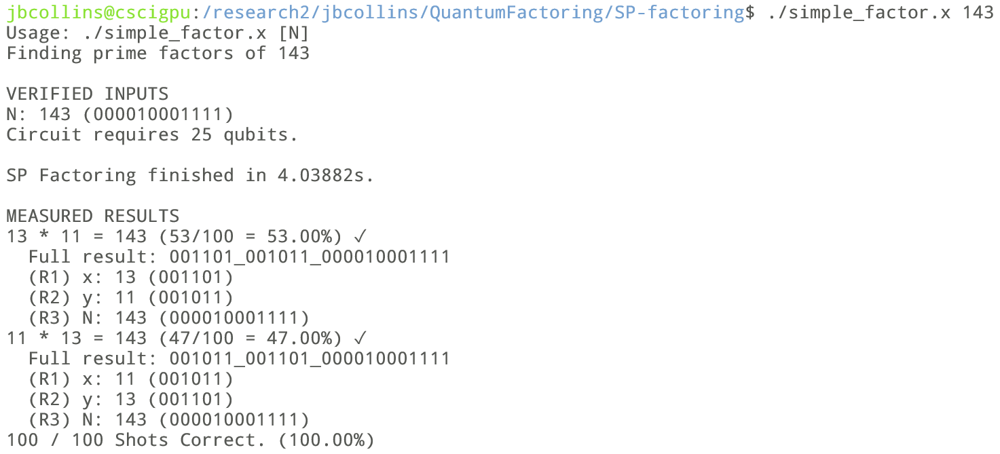

# Repo Summary

Quantum computing research at CSU, Chico.

Code is written using [CUDA-Q C++](https://nvidia.github.io/cuda-quantum/latest/index.html).

## Notes

Code can be compiled with `make` as a standalone command, and run with `./filename.x`. If arguments are required, they will be
described when the program is run without arguments. Code in [in-progress](in-progress/) is not guaranteed to work.



## TODO:

- [x] Addition (Semiclassical)
- [x] Grover's (Simple)
- [ ] Grover's (Index search) ~90%
- [x] Inverse Addition (Semiclassical)
- [x] QFT Addition (Out of place)
- [x] QFT Inverse Addition (Out of place)
- [x] QFT Scaled Addition (Out of place)
- [x] QFT Multiplication (Out of place)
- [x] **QFT Inverse Multiplication** (Out of place)
- [ ] QFT Addition (In-place)
- [ ] QFT Inverse Addition (In-place)
- [ ] QFT Scaled Addition (In-place)
- [ ] QFT Multiplication (In-place)
- [ ] **QFT Inverse Multiplication** (In-place)

## CudaQ Environment

### Option 1: cscigpu (Recommended)

The cscigpu server `<user>@cscigpu.csuchico.edu` already has CudaQ for C++ and Python installed.

To access, first make sure you are connected through the [CSU Chico GlobalProtect VPN](https://support.csuchico.edu/TDClient/1984/Portal/KB/?CategoryID=15690), then run:
```
ssh <user>@cscigpu.csuchico.edu
```
Now you can move on to the [setup](#setup) section.

### Option 2: Local Installation

Based on instructions provided in the [CudaQ Documentation](https://nvidia.github.io/cuda-quantum/latest/using/quick_start.html#install-cuda-q)

- Verify that you have cuda version 12+ installed
```{sh}
nvcc --version
```
- Download latest CUDA-Q version [here](https://github.com/NVIDIA/cuda-quantum/releases)
- Install with the following command:
```{sh}
sudo -E bash install_cuda_quantum*.$(uname -m) --accept
. /etc/profile
```
\*note: This code was developed using CUDA-Q version 0.8.0, and will require additional flags in the Makefile to compile in the most recent version.

## Setup

It is recommended to connect your github account with SSH: [Instructions here](https://docs.github.com/en/authentication/connecting-to-github-with-ssh/adding-a-new-ssh-key-to-your-github-account)

```{sh}
git clone git@github.com:collinsjacob127/QuantumFactoring.git && \
cd QuantumFactoring/test-install && \
make && \
./test-install.x
```


